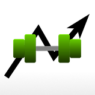

# Next Set - A Workout Tracker

Next Set is a workout planning and tracking app that makes it easy for you to log and track your workouts and reach your fitness goals.

- Add exercises and create workout templates, or just log a workout on the fly.
- Organize your templates into programs to follow and let the app keep track of which workout is up next.
- Visualize your progress over time through graphs on the Stats page, including workout volumes, average set and rep weights, rep counts, and more.
- Create templates with more complex setups than just a series of exercises. Add circuits for repeated sets of exercises. Add randomly selected exercises to give some variety to your workouts.

No ads. No in-app purchases. Once you have Next Set you can use all it's features.
